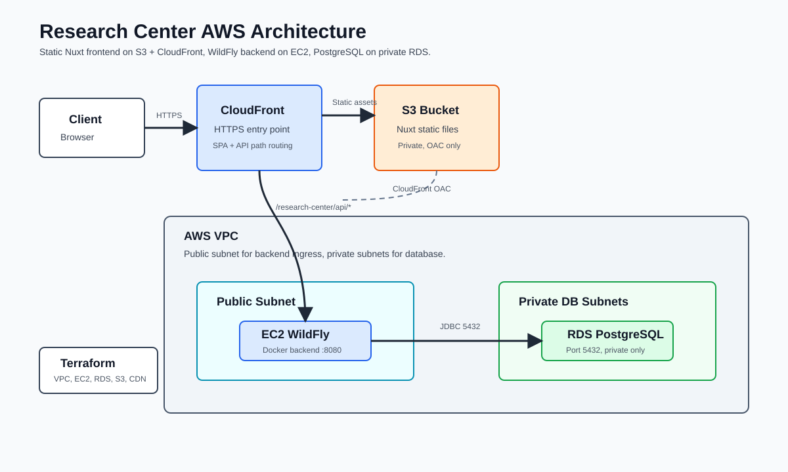

# Research Center

Research Center is a full-stack publication management platform for academic research groups. It provides a Jakarta EE backend, a Nuxt client, local Docker orchestration, and Terraform definitions for AWS production infrastructure.

## Contents

- [Architecture](#architecture)
- [Repository Layout](#repository-layout)
- [Prerequisites](#prerequisites)
- [Local Development](#local-development)
- [Verification](#verification)
- [AWS Infrastructure](#aws-infrastructure)
- [Operational Notes](#operational-notes)
- [Troubleshooting](#troubleshooting)

## Architecture

### Backend

- Java 17 Jakarta EE application packaged as a WAR.
- WildFly application server.
- JAX-RS API mounted at `/research-center/api`.
- JPA/Hibernate persistence.
- PostgreSQL datasource bound at `java:/ResearchCenterDS`.
- JWT bearer authentication with role-based authorization.
- Seed data loaded at startup through `ConfigBean`.

### Frontend

- Nuxt 4 SPA in `research-center-client`.
- Tailwind CSS.
- Default API base URL: `http://localhost:8080/research-center/api`.
- Production static hosting through private S3 and CloudFront.

### Local Services

Docker Compose starts:

- `webserver`: WildFly backend container.
- `db`: PostgreSQL.
- `smtp`: fake SMTP server for password recovery email flows.
- `ollama`: local LLM service used by AI summary features.

### AWS Infrastructure

Terraform code in `terraform/` defines:

- VPC with public subnets and private database subnets.
- Public frontend Application Load Balancer.
- EC2 instance that bootstraps Docker, clones the repository, and starts the backend stack with Docker Compose.
- Private RDS PostgreSQL instance.
- Security groups that restrict PostgreSQL port `5432` to the backend application server.



## Repository Layout

```text
.
├── src/main/java/...              # Jakarta EE backend source
├── src/main/resources/META-INF    # JPA/CDI configuration
├── research-center-client         # Nuxt frontend
├── terraform                      # AWS infrastructure as code
├── scripts                        # Local helper scripts
├── Dockerfile                     # WildFly backend image
├── docker-compose.yaml            # Local service stack
├── Makefile                       # Local build/deploy commands
└── api-endpoint-spec_final.md     # REST API specification
```

## Prerequisites

Local development:

- Docker and Docker Compose.
- Java 17.
- Maven, or the included Maven wrapper through `bash mvnw`.
- Node.js and npm.
- Terraform 1.6 or newer for infrastructure work.

AWS deployment:

- AWS credentials configured outside the repository.
- Permission to manage VPC, EC2, IAM, ALB, RDS, S3, and CloudFront resources.
- Secure values supplied through environment variables or a secrets workflow.

## Local Development

### 1. Configure Environment

Create a local environment file:

```bash
cp .env.example .env
```

Review `.env` before starting services. Do not commit `.env`.

### 2. Start Local Services

```bash
make up
```

This builds and starts the backend, PostgreSQL, fake SMTP, and Ollama containers.

### 3. Build and Deploy Backend

```bash
make deploy
```

This builds `target/research-center.war` and copies it into the running WildFly container.

If Maven is not installed locally, use:

```bash
bash mvnw test
```

Note: `mvnw` may not have execute permission in a fresh checkout. Running it through `bash mvnw` avoids that issue.

### 4. Start Frontend

```bash
cd research-center-client
npm install
npm run dev
```

Frontend URL:

```text
http://localhost:3000
```

Backend API URL:

```text
http://localhost:8080/research-center/api
```

For a deployed frontend outside CloudFront, set the public Nuxt API base URL before build/start:

```bash
export NUXT_PUBLIC_API_BASE='http://BACKEND_PUBLIC_DNS:8080/research-center/api'
```

## Verification

Backend compile/test lifecycle:

```bash
bash mvnw test
```

Frontend production build:

```bash
cd research-center-client
npm run build
```

Terraform formatting and validation:

```bash
terraform fmt -check -diff terraform
terraform -chdir=terraform init -backend=false
terraform -chdir=terraform validate
```

Current project note: there is no `src/test` tree yet, so Maven reports that no tests are available.

## AWS Infrastructure

Terraform lives in `terraform/`.

Required sensitive variables:

```bash
export TF_VAR_db_password='change-me'
export TF_VAR_wildfly_admin_password='change-me'
```

Standard workflow:

```bash
terraform -chdir=terraform init
terraform -chdir=terraform fmt -check
terraform -chdir=terraform validate
terraform -chdir=terraform plan
terraform -chdir=terraform apply
```

Quick apply:

```bash
terraform -chdir=terraform init && terraform -chdir=terraform apply
```

The EC2 backend bootstrap installs Docker, Docker Buildx, and Docker Compose, clones the configured repository, writes the `.env` file from Terraform variables, builds the WAR, starts an AWS-specific Docker Compose backend service, and deploys the WAR into the WildFly container. The AWS bootstrap points the backend at RDS and intentionally does not start the local development PostgreSQL or Ollama services.

Terraform also creates a private S3 bucket and CloudFront distribution for the generated Nuxt frontend. CloudFront serves the SPA from S3 and forwards `/research-center/api/*` requests to the backend EC2 instance, so the deployed frontend can use the relative API base `/research-center/api` over HTTPS.

After infrastructure is applied and the backend API is healthy, deploy the frontend static files:

```bash
scripts/deploy-frontend.sh
```

The script reads Terraform outputs, sets `NUXT_PUBLIC_API_BASE` to `/research-center/api` by default, runs `npm ci`, generates the Nuxt site, uploads `.output/public` to S3, and creates a CloudFront invalidation.

Override the API base when needed:

```bash
NUXT_PUBLIC_API_BASE='https://api.example.com/research-center/api' scripts/deploy-frontend.sh
```

Frontend URL:

```bash
terraform -chdir=terraform output -raw frontend_static_url
```

## Operational Notes

- Local Docker uses PostgreSQL in a container; Terraform uses managed RDS PostgreSQL.
- Production database subnets are private and do not receive public IPs.
- The database security group allows `5432` only from the backend application security group.
- RDS deletion protection is enabled by default.
- The frontend ALB is internet-facing and spans public subnets.
- The Nuxt frontend is hosted from private S3 through CloudFront.
- HTTPS on the frontend ALB is enabled when `frontend_certificate_arn` is provided.
- Custom CloudFront frontend domains require an ACM certificate in `us-east-1` via `frontend_cloudfront_certificate_arn`.
- `persistence.xml` currently uses `drop-and-create`, which recreates schema on startup. Change this before using persistent production data.

## Troubleshooting

Check container status:

```bash
make ps
```

Follow backend logs:

```bash
make logs
```

Open a shell in the WildFly container:

```bash
make bash
```

Access PostgreSQL locally:

```bash
make sql
```

Inspect fake SMTP mail storage:

```bash
make mails
```

Tear down local containers, local images, and volumes:

```bash
make down
```

Remove all Compose resources, including non-local images:

```bash
make down-all
```
